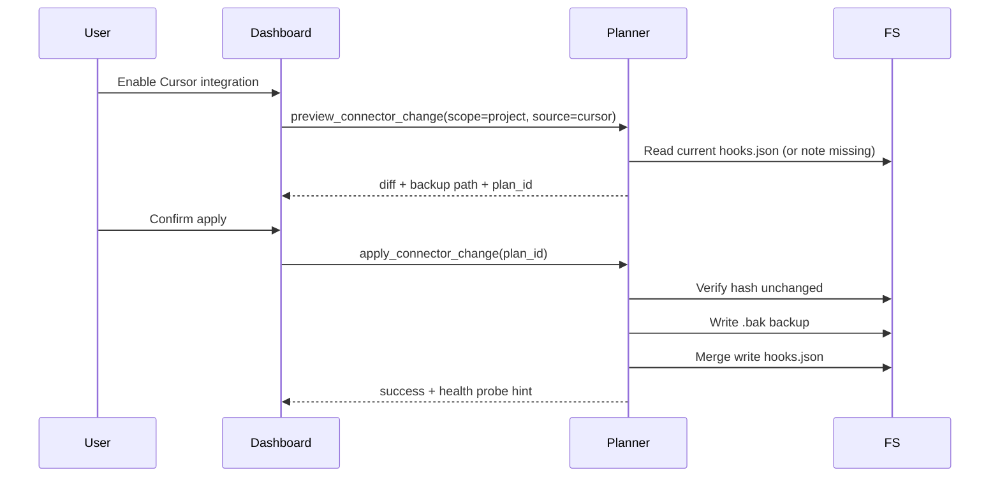

# Installation, diff preview, backup, and rollback

Integrations are **never silently installed**. This document describes the intended dashboard installer flow and the safe manual procedure until that UI ships.

## Principles

1. Show a unified diff before any write
2. Backup the previous file with a stable suffix
3. Merge llm_notch entries; never delete unrelated hooks
4. Abort if the target file hash changed after preview
5. Reject path escapes (symlinks outside home/project)

## Scopes

| Vendor | User scope | Project scope |
|--------|------------|---------------|
| Cursor | `~/.cursor/hooks.json` | `<repo>/.cursor/hooks.json` |
| Claude Code | `~/.claude/settings.json` | `<repo>/.claude/settings.json` |
| Codex | `~/.codex/hooks.json` | `<repo>/.codex/hooks.json` |
| Gemini CLI | `~/.gemini/settings.json` | `<repo>/.gemini/settings.json` |

Project scope is preferred when the team wants shared, reviewable config.

## Installer flow (implemented in `notch-connectors`)

The dashboard can call Tauri commands backed by `notch-connectors`:

| Command | Input | Output |
|---------|-------|--------|
| `detect_connectors` | — | Allowlisted-path scan results |
| `preview_connector_change` | `source`, optional `scope` | `ConnectorPlanPreview` (5-minute TTL) |
| `apply_connector_change` | `planId` only | `ConnectorApplyResult` |
| `remove_connector` | `source`, optional `scope` | `ConnectorApplyResult` |
| `repair_connector` | `source`, optional `scope` | `ConnectorPlanPreview` |
| `rollback_connector` | `backupId` | `ConnectorPlanPreview` |

Apply accepts **only** `planId`. Display paths in previews are redacted labels; canonical identities stay backend-only.

### Safety guarantees

- Cross-process lock + hash re-check under lock before write
- Per-file atomic replace (`ReplaceFileW` on Windows, rename on Unix)
- Backup journal at `<app-data>/connector-journal.json`
- Idempotent reinstall → empty diff, `Skipped` outcome, no backup
- Rollback: exact restore when `currentHash == appliedHash`; hash mismatch yields a recomputed additive recovery preview (remove managed entries only)

## Legacy sequence diagram



## Merge algorithm (hooks.json)

Applies to Cursor and Codex `hooks.json` (version `1` for Cursor).

```
for each event in template:
  if event not in target.hooks:
    target.hooks[event] = template.hooks[event]
  else:
    for each templateEntry in template.hooks[event]:
      if no existing entry with same command string:
        append templateEntry
return target
```

Claude Code uses nested `hooks → Event → [{matcher, hooks:[...]}]`. Merge matches on `(event, matcher, command)` triples. Gemini CLI uses the same nested `settings.json` hook structure.

**Never remove** entries the user or other tools added.

## Manual install (until dashboard ships)

1. Copy wrapper scripts to a stable location:

   ```bash
   mkdir -p ~/.cursor/hooks
   cp integrations/wrappers/llm-notch-hook-wrapper.sh ~/.cursor/hooks/
   chmod +x ~/.cursor/hooks/llm-notch-hook-wrapper.sh
   ```

2. Preview diff:

   ```bash
   diff -u ~/.cursor/hooks.json integrations/cursor/hooks.json.template || true
   ```

3. Backup:

   ```bash
   cp ~/.cursor/hooks.json ~/.cursor/hooks.json.llm-notch.bak.$(date +%Y%m%dT%H%M%S)
   ```

4. Merge manually or copy template after editing paths to `hooks/llm-notch-hook-wrapper.sh`.

5. Restart Cursor / Claude Code / Codex / Gemini CLI.

## Backup naming

```
<original>.llm-notch.bak.<YYYYMMDDTHHMMSS>
```

Examples:

- `~/.cursor/hooks.json.llm-notch.bak.20260711T110300`
- `.claude/settings.json.llm-notch.bak.20260711T110300`

Keep at least one backup until integration health shows connected.

## Rollback

```bash
# List backups
ls -1 ~/.cursor/hooks.json.llm-notch.bak.*

# Restore
cp ~/.cursor/hooks.json.llm-notch.bak.20260711T110300 ~/.cursor/hooks.json
```

PowerShell:

```powershell
Copy-Item "$env:USERPROFILE\.cursor\hooks.json.llm-notch.bak.20260711T110300" `
  "$env:USERPROFILE\.cursor\hooks.json" -Force
```

After rollback, restart the agent host. llm_notch integration health should return to disconnected.

## Hash guard (installer)

If `sha256(target) != sha256(preview_snapshot)` at apply time:

- Abort with `FILE_CHANGED_SINCE_PREVIEW`
- Do not write
- User must re-run preview

## Post-install verification

| Check | Expected |
|-------|----------|
| llm_notch app running | Tray icon present |
| Helper on PATH or bundled | `command -v llm-notch-hook` or absolute bundle path |
| Hook fires | Wrapper exits 0; host receives ingest (when IPC live) |
| Dashboard → Integrations | Cursor shows `events: true`, `decisionResponse: false` |

See [troubleshooting.md](./troubleshooting.md) if health stays disconnected.

## Example artifacts

- [Generated diff example](./examples/generated-diff.md)
- [Backup / rollback walkthrough](./examples/backup-rollback.md)
