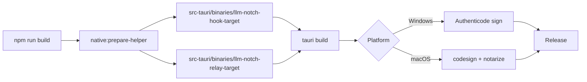

# Platform release gates

Lane 9 defines the minimum gates before distributing signed desktop builds.

## Artifact pipeline



## Sidecar packaging (`externalBin`)

`src-tauri/tauri.conf.json` declares:

```json
"externalBin": ["binaries/llm-notch-hook", "binaries/llm-notch-relay"]
```

`npm run native:prepare-helper` copies the Cargo `notch-hook` and `notch-remote` binaries to:

```
src-tauri/binaries/llm-notch-hook-<rust-target-triple>[.exe]
src-tauri/binaries/llm-notch-relay-<rust-target-triple>[.exe]
```

Tauri renames these to `llm-notch-hook` / `llm-notch-hook.exe` and `llm-notch-relay` / `llm-notch-relay.exe` beside the main executable in the bundle. Runtime resolution lives in `src-tauri/src/runtime/helper_path.rs` and `src-tauri/src/runtime/relay_path.rs` and is logged at host startup.

Cross-compiled relay sidecars for SSH remote deploy use target-suffixed filenames under the same `binaries/` directory (for example `llm-notch-relay-x86_64-unknown-linux-gnu`). CI builds them unsigned on native runners via `npm run native:prepare-relay -- --target <triple>`; release workflows attach them to draft GitHub Releases and bundle them as Tauri resources when present. They are **not** Authenticode/codesign verified (relay signing is not yet wired).

## Windows overlay guarantees (validated in CI)

| Guarantee | Mechanism |
|-----------|-----------|
| Topmost HUD | `SetWindowPos(HWND_TOPMOST, SWP_NOACTIVATE)` |
| No taskbar button | `WS_EX_TOOLWINDOW`, `WS_EX_APPWINDOW` cleared |
| No focus steal | `WS_EX_NOACTIVATE` + `WM_MOUSEACTIVATE → MA_NOACTIVATE` subclass |
| Per-monitor DPI | Process must be per-monitor aware (V2 preferred); validated in `native_windows` tests |

`show_over_fullscreen` is **unsupported** on Windows; persisted preference is reset at startup.

## macOS overlay honesty

| Approach | Status |
|----------|--------|
| `NSWindow` + `NonactivatingPanel` style mask | Implemented (Tauri default construction path) |
| True `NSPanel` at construction | Not available without forking Tauri window creation |
| `FullScreenAuxiliary` | Best-effort only; not guaranteed over every fullscreen host |

See [`macos-overlay.md`](macos-overlay.md).

## Signing gates (secrets required)

| Gate | Script | Blocks release when |
|------|--------|---------------------|
| Authenticode | `scripts/signing/sign-windows.ps1` | Secrets absent or signature not `Valid` |
| Developer ID + notarization | `scripts/signing/notarize-macos.sh` | Helper missing, codesign verify fails, or notary rejects |

CI runs `release-gates` job to verify scaffold files exist; it does **not** sign.

## Local verification (unsigned)

```powershell
cargo test -p llm-notch-desktop --test native_windows
cargo test --workspace
npm run test:run
npx playwright test --project=chromium --project=webkit
```
